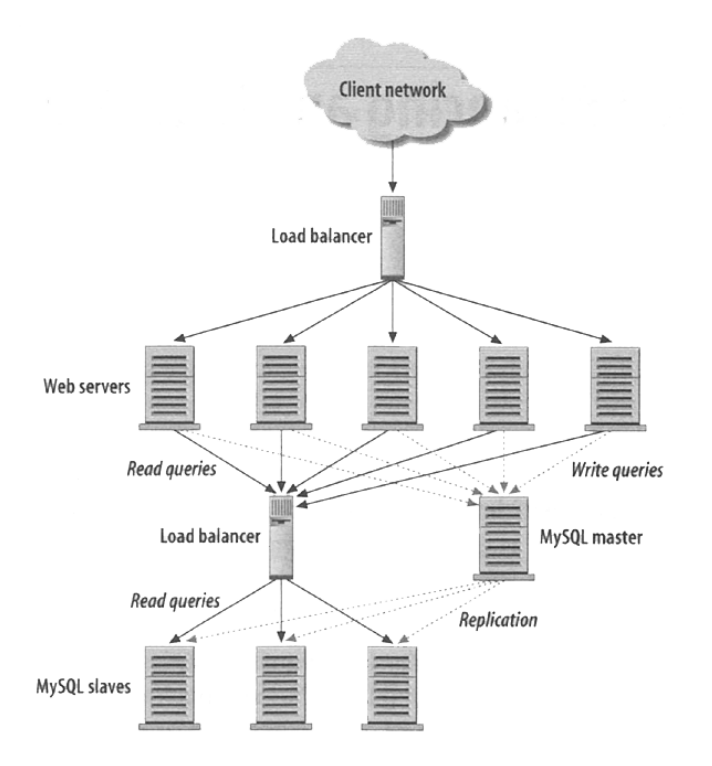
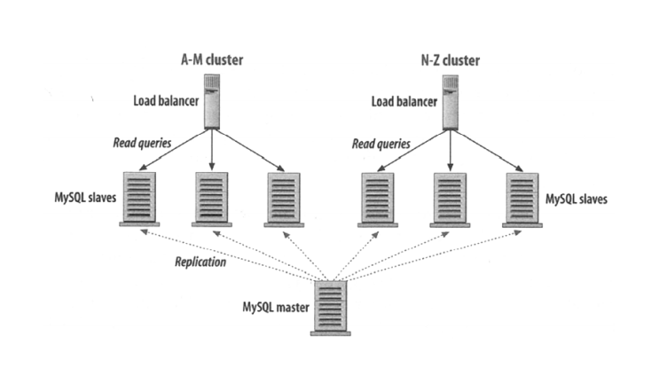
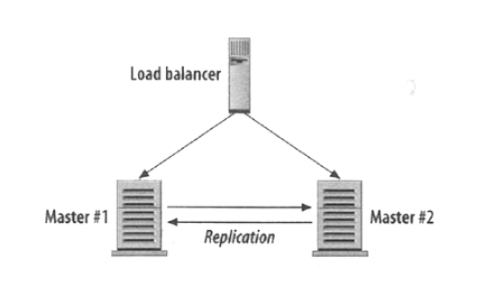

# 可规模性
服务器规模:
 - sun - 4 sql server - 1.5dba - 160 web server - 8 memcached server
 - flickr - 166 sql server - 244 web server - 14 memcached server
 - facebook - 1800 sql - 2dba - 10000 web server - 805 memcached server
 - wikipedia - 70 memcached server


## 硬件

### 垂直规模化
专用高性能服务器
不可持续,高花费

 - cpu
 - drive
    - sas,ssd,raid
 - ram

### 水平规模化
多廉价服务器,通过软件负载均衡
长远解决方案

 - hadoop MapReduce

### php优化
 - 代码优化
    - 高速算法
 - 缓存
    - 缓存动态生成的html
    - 程序缓存
        - 操作码、字节码技术
        - JIT
        - APC/eAccelerator/XCache/Zend

#### JIT和AOT
代码发布前先编译，是比JIT更早的通用办法，称为AOT（ahead of time），c语言便是这种执行模式
JIT的思想很简单，即在程序运行时动态对程序进行编译，生成平台相关的机器码，从而加快程序运行速度
JIT优势
 - 发布速度快
 - 优化效率更好,因为JIT是基于Runtime信息
 - 粒度更精细
 - 对开发者透明

## 多服务器
 - cdn服务器
 - cdn服务器备份
 - ssh登录服务器

### 负载均衡服务器
client --> load balancer --> server
 - 多VM机制提升性能
 - 冗余

### load balancer
#### 轮询调度
 - DNS
    - A记录映射
 - Virtual Ip
    - HAProxy
        - tcp轮询映射
            - www1
            - www2
            - ...

>多服务器session问题
>轮询调度不知道服务器内的情况,无法达到完全均衡
>linux:ps(process list),top

#### 双向负载均衡
调度器定时查询服务器负载
>负载均衡器本身没有冗余

#### 无负载均衡器的负载均衡
利用DNS服务器的轮询调度功能
1. 全公网ip服务器
2. DNS为域名设定多个ip地址

 - 节省负载均衡器成本
 - dns服务器更稳定，本身有冗余
 - 没有双向沟通
 - dns缓存问题
 - 服务器不能停机更新

##### BIND
```
www in A 1.1.1.1
www in A 1.1.1.2
www in A 1.1.1.3
www in A 1.1.1.4
```

### 多服务器共享session问题
1. session数据库
>session数据库冗余问题

2. 共享存储
 - FC(光钎),iSCSI,NFS(网络文件系统)
>文件锁问题

#### 基于cookie的负载均衡
```
//服务器session
sessionID --> server number(可以通过hash或者截取等方式)
load balancer -- server number --> server
//load balancer生成session
load balancer --> server key as session
load balancer -- server key --> server
```

#### 基于ip的负载均衡
 - 选择ip地理附近的服务器
 - hash ip得到服务器标号

>没有均衡器或者单向均衡器都有冗余问题,容易出现偏斜

#### 常用均衡器
 - Software
    - ELB
    - HAProxy
    - LVS(网络层)
 - Hardware
    - Barracuda
    - Cisco
    - Citrix
    - F5

#### ssl专用硬件
client -- 加密 -- ssl server -- 明文 -- app server

## 缓存
1. html缓存
2. 数据库查询缓存
3. Memcached
read heavy
### 静态化缓存
1. 动态数据定时生成html
2. 文件存到内存,优化图片

无法明确哪个请求需要缓存

缺点:
    - 用户写入有一定延时
    - 需要额外存储空间
    - 网页更新需要全部重新生成

### MySQL Query Cache
``` /etc/my.cnf
query_cache_type = 1
```

缺点:
    - 数据库需要跟踪
    - 额外的存储空间
    - 缓存重建问题

### Memcached
Memcached Daemon
序列化
```php
$memcache = memcache_connect(HOST, PORT);
$user = memcache_get($memcache, $id);
if (is_null($user))
{
 $dbh = new PDO(DSN, USER, PASS);
 $result = $dbh->query("SELECT * FROM users WHERE id=$id");
 $user = $result->fetch(PDO:FETCH_ASSOC);
 memcache_set($memcache, $user['id'], $user);
}
```
>尽量减少数据库连接

### 数据库及引擎选择
1. redis内存数据库
2. MySQL heap engine
3. MySQL NDB集群 主从

### Replication: Master-Slave（主从结构）
因为读取要远多于写入
1. 单master多slave
2. 写入主服务器时会复写到从服务器
3. 读取则从从服务器读取

缺点
 - 单点故障

#### 多master多slave

缺点
 - 一致性问题
    - 分割

#### 负载均衡+Replication



### Partitioning 分割
cluster


### HA 高可用性


1. 均衡器心跳查询
2. ip转交
3. 浮动ip地址